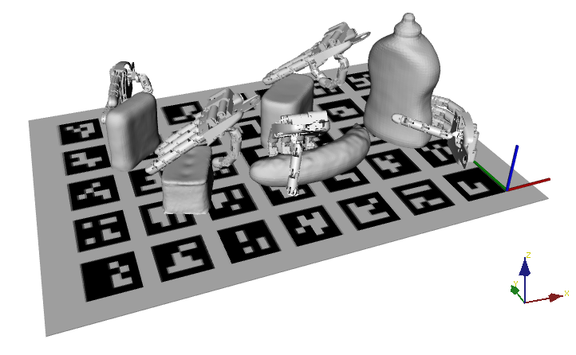

# Grasp quality computation

This program computes a theoretical grasp quality measure on the benchmark objects and layouts, for a number of grasps synthesized by any grasp planner the user wishes to benchmark.

The program makes use of the Grasp Wrench Space metric implemented in the GraspStudio framework (included in the Simox build). Such metric estimates the radius of the largest sphere contained in the Grasp Wrench Space, normalized with respect to the largest sphere contained in the Object Wrench Space. More info on GWS and OWS can be found in [1].

## Requirements

In order to perform such computation, the user needs to provide the following inputs:
- End effector collision model
- End effector kinematics
- Synthesized grasps

#### Robot/End effector model

GraspStudio needs the end effector collision model in order to estimate contact points on the object that is being grasped. Object models are already provided with the benchmark, so the user only needs to provide their own end effector collision model.

[Simox](https://gitlab.com/Simox/simox/) already comes bundled with many popular end effector and robot models, however users might still need to import their own. Please refer to the [guide](https://gitlab.com/Simox/simox/wikis/RobotModels) on the Simox Wiki for this.

#### End effector kinematics

Contact point location is estimated by closing the end effector around objects, according to its joints type and range. Therefore, the user needs to provide the end effector kinematics as instructed in the [Simox guide](https://gitlab.com/Simox/simox/wikis/RobotModels) if not already present in the library.

#### Synthesized grasps

According to the GRASPA protocol, grasps must be synthesized for each graspable object in the layouts. Users need to employ the grasp planning algorithm they wish to benchmark and provide grasp poses with respect to the layout reference frame, as 4x4 matrices.

The pose defined in the 4x4 matrices refers to the TCP (Tool Center Point) defined in the end effector XML file.

Example grasps can be found in the [GRASPA test directory](https://github.com/robotology-playground/GRASPA-test/tree/master/experiment_data/right_arm/grasps_data), for each object in each layout.

## Usage

__Important:__ the `SIMOX_DIR` environment variable must be set in order for the program to detect the location of the robot XML files (if using those bundled with Simox).

Arguments:
- `datapath`: where the GRASPA object XMLs are stored (typically, this is the root of the repo)
- `graspsdir`: path to where user-defined grasps are stored. The parser implies this directory contains a directory with the same name as the scene (layout) being used. An instance of such directory tree is [this](https://github.com/robotology-playground/GRASPA-test/tree/master/experiment_data/right_arm/grasps_data)
- `robot`: robot or end effector XML file. If using robots in the Simox library, this points to somewhere in `$SIMOX_DIR/VirtualRobot/data/robots`
- `scene`: XML scene filename, containing object poses. Any scene in [this directory](https://github.com/robotology/GRASPA-benchmark/tree/master/data/scenes/grasping/3D_scenes)
- `approach`: enables the approach motion while detecting contacts [need to be documented further].

## Example

Suppose the `SIMOX_DIR` environment variable is set, the variable `GRASPA_DIR` points to the root of [the benchmark repo](https://github.com/robotology/GRASPA-benchmark) and the variable `TEST` points to the root of [our test repo](https://github.com/robotology-playground/GRASPA-test). The executable can be run from the build directory as

```
./compute-grasp-quality --scene $GRASPA_DIR/data/scenes/grasping/3D_scenes/layout_0.xml --graspsdir $TEST/experiment_data/right_arm/grasps_data --datapath $GRASPA_DIR --robot $SIMOX_DIR/VirtualRobot/data/robots/iCub/iCub.xml

```

The program will load the scene, objects and the robot end effector. It will compute the grasp quality for every pose for every object in the layout according to the metric that we described earlier. As output, it will show something like



If there are more grasps planned for the same object, more instances of the end effector will show up in the corresponding poses.

The script will write the computation results in the `graspsdir` by adding a `<ComputedQuality>` field. In this example, planning 5 grasps for each object results as the following field being added to [this file](https://github.com/robotology-playground/GRASPA-test/blob/master/experiment_data/right_arm/grasps_data/layout_0/YcbBanana_grasp.xml):

```
<ComputedQuality>
    <Grasp name="Grasp 0" quality_collision_free="0.357533" quality_overall="0.250273"/>
    <Grasp name="Grasp 1" quality_collision_free="0.0883257" quality_overall="0.0529954"/>
    <Grasp name="Grasp 2" quality_collision_free="0.372534" quality_overall="0.149013"/>
    <Grasp name="Grasp 3" quality_collision_free="0.37403" quality_overall="0.299224"/>
    <Grasp name="Grasp 4" quality_collision_free="0.438608" quality_overall="0.219304"/>
</ComputedQuality>
```

`quality_collision_free` refers to the quality of each grasp planned for the object (averaged over a set of perturbations) only in case the grasps are not in a collision state with the object
`quality_overall` refers to the average quality of all perturbed grasps, regardless of whether they are initially in collision or not.


## References
[1] Ch. Borst, M. Fischer, and G. Hirzinger, “Grasp planning: how to choose a suitable task wrench space,” in IEEE International Conference on Robotics and Automation, 2004. Proceedings. ICRA ’04. 2004, New Orleans, LA, USA, 2004, pp. 319-325 Vol.1.
